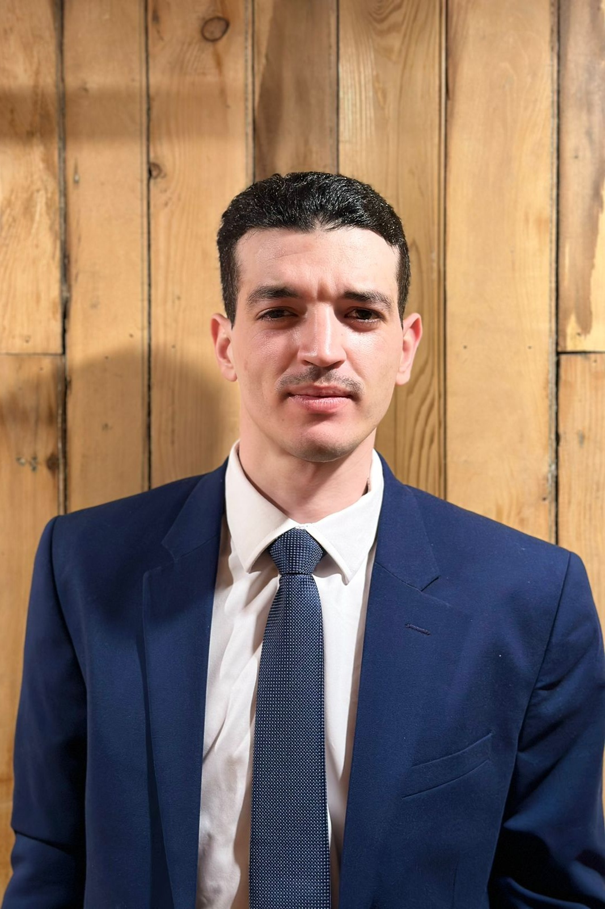

<html lang="fr">
<head>
  <meta charset="UTF-8">
  <meta name="viewport" content="width=device-width, initial-scale=1.0">
  <link rel="stylesheet" href="style.css">
</head>
<body>
  <!-- Barre de navigation -->
  <nav>
    <ul>
      <li><a href="index.html" id="home-link">Accueil</a></li>
      <li><a href="projects.html" id="projects-link">Projets</a></li>
      <li><a href="resume.html" id="resume-link">CV</a></li>
      <li><a href="contact.html" id="contact-link">Contact</a></li>
    </ul>
  </nav>

  <header class="header">
   <h1>Network and Systems Engineer</h1> 
  </header>

  <main>
    <section class="about-me">
      <h2>À propos de moi</h2>
      
Technicien informatique bilingue avec une expertise en réseau, Active Directory, dépannage, Linux, Azure et support client.

      
Opérateur de systèmes de chronométrage électronique (Finish Lynx, MyLaps, Seltec).

    </section>
  </main>
    <footer>
    
Copyright &copy; 2023 - med riad cherid

  </footer>
</body>
</html>
